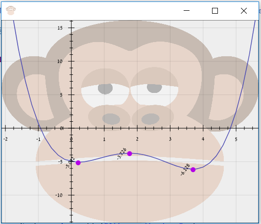

POLYNOM
=========

This project represent Polynom and Monom.

examples for a correct format of Polynom:
x^2, 3x^2+5-3x, 25*x^7-3*x^2+3

examples for an incorrect format of Polynom:
5a, xx, x^-2, 8**2, 9x--6x^2, 6x^

Features
--------
- Add- adding Polynom/Monom to existing Polynom
- Sub
- F-  returns the value of the function of specific point x
- Derivative
- Multiplication
- Eqals- checks if two polynoms are equal
- IsZero- checks if a Polynom is empty
- Root- finds the root of the Polynom
- Area- calculates the area of a Polynom in a given range 
- AreaUnder- calculates the area under the X line

Graph
--------
The graph is an open source library which can be found at <a href="https://github.com/eseifert/gral">https://github.com/eseifert/gral</a>.

The graph shows minimum and maximum points on the function:

General info
--------------
Read more in Wiki:
- Polynomial: https://de.wikipedia.org/wiki/Polynom
- Monomial: https://en.wikipedia.org/wiki/Polynomial
- Derivative: https://en.wikipedia.org/wiki/Derivative
- Riemann's Integral: https://en.wikipedia.org/wiki/Riemann_integral
- Root: https://en.wikipedia.org/wiki/Properties_of_polynomial_roots
